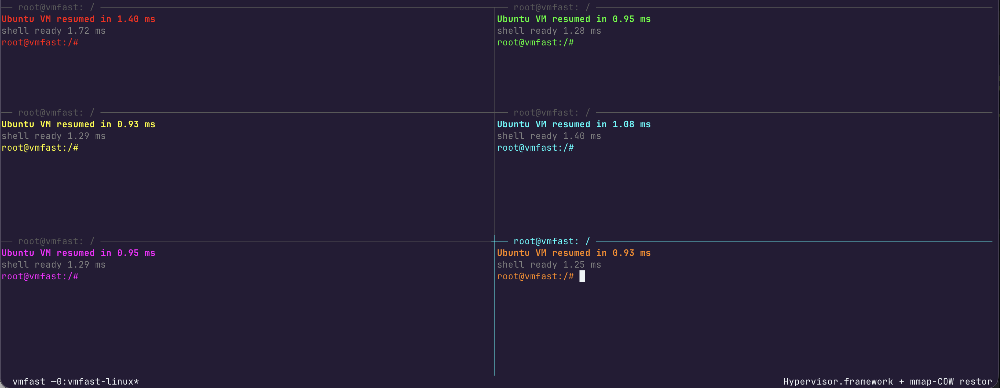

t# Full Ubuntu VMs in 1ms

Demoware project showing that a real Linux VM can cold-start in **~1 millisecond** on a Mac, with about 1400 lines of Swift and a kernel-loader trick.



Real Ubuntu 24.04 LTS, real GNU bash, real glibc, real `/etc`, real interactive pty — cold-started from absolutely nothing in roughly the same amount of time as a single context switch.

---


## About

Every week somebody launches a new sandbox, with increasingly fast "instant starts". 

I want to end that race because its dumb. This is a VM Platform in 1400 lines of code that starts **VMs in 1ms**.

It's not fake, its full Ubuntu with hardware virtualization, in 1ms. No **warm pools** thats cheating and lame.
 
It's not a product, its not production ready. Its an opensource demo of how to do 1ms VMs.

## Setup

You need: **macOS 14+ on Apple Silicon**, Xcode Command Line Tools (`xcode-select --install`), and Homebrew.

```bash
git clone <this repo>
cd vmfast-linux
./install.sh
```

`install.sh` does the one-time work: `brew install dtc lld`, downloads the Ubuntu kernel and Alpine busybox, builds everything, then cold-boots Ubuntu once to capture the snapshot.

## Run

```bash
./artifacts/vmfast-linux restore       # one VM, into an interactive shell
./demo-tmux.sh                         # 6 VMs in a tmux grid, each its own color
./demo-tmux.sh 4                       # 4-pane variant
```

Each pane is an independent, fully isolated Linux VM with its own copy-on-write memory view. They share the snapshot file (read-only), but their writes don't affect each other.

---


## How it works (in plain language)

There's no magic. The whole thing is three ideas stacked on top of each other:

### 1. Boot Linux once, snapshot it, never boot it again

Booting Linux from scratch is slow — ~330 ms for our setup, ~3.6 seconds for a full Ubuntu cloud image. So we do it **exactly once**, on first install. The moment the kernel hands control to userspace (`/init` runs, draws a prompt), we **pause the VM and dump everything**:

- All 256 MB of guest RAM goes to `artifacts/snapshot.ram` as a sparse file (zeros aren't actually stored; APFS sparse-encodes it down to ~80 MB on disk)
- All 31 general-purpose registers + the PC + PSTATE/CPSR + 35 system registers (including the ARMv8.3 pointer-authentication keys, which is the part you'll forget if you try this yourself) go to `artifacts/snapshot.state`

That's the snapshot. From then on, we never boot again.

### 2. "Restore" is just `mmap(MAP_PRIVATE)` — the OS does the work

The trick: when you `mmap` a file with `MAP_PRIVATE`, the OS gives you a view of the file's pages that's **copy-on-write**. Reading touches the file's existing pages (shared via the page cache). Writing copies the page first, then mutates the copy — but only the pages you actually touch.

So a "fresh VM" is just:

```c
void *guest_ram = mmap(NULL, 256*MB, READ|WRITE, MAP_PRIVATE, snapshot_fd, 0);
hv_vm_map(guest_ram, GUEST_IPA, 256*MB, READ|WRITE|EXEC);
// reload registers from snapshot.state
hv_vcpu_run(vcpu);
```

`mmap` is **constant time in the size of the snapshot**. It doesn't read 256 MB; it just sets up virtual address translations. The first time the guest touches a page, the kernel pages it in. The first time the guest writes to a page, the kernel copies it. You only pay for what the guest actually uses.

For the ~5 ms it takes to draw a shell prompt, the guest touches roughly **1–2 MB of memory**. That's what the cold start actually costs.

### 3. The whole VMM is small enough to read in one sitting

The Swift program that owns the VM is ~700 lines. It handles:

- ARM64 Linux boot protocol (load kernel + DTB, set 6 registers, jump)
- A trapped PL011 UART (so the kernel can `printk` and userspace can read/write)
- A stub GIC v3 (enough that the kernel's interrupt-controller probe passes; we deliver one IRQ: PL011 RX)
- A stub PSCI (so the kernel doesn't panic asking how to power off)
- The mmap-COW snapshot/restore
- A small virtio-net device bridged to a userspace libslirp NAT (host↔guest TCP)

No disk emulation, no SMP. The deliberately tiny surface is *why* it's so fast and *why* it fits in a weekend.

---

## Tech stack

| Layer | What we use |
|---|---|
| Hypervisor | macOS `Hypervisor.framework` — Apple's low-level CPU-virtualization API. Not `Virtualization.framework` (which is the high-level "show me a VM" thing). |
| Host language | Swift, for the VMM + run loop |
| Guest CPU | One ARM64 vCPU at EL1 |
| Guest kernel | Stock Ubuntu 24.04 arm64 kernel (6.8.0), unmodified |
| Guest userspace | Real Ubuntu 24.04 LTS base rootfs (`ubuntu-base`, ~100 MB extracted) — glibc, bash, coreutils, /etc, apt, dpkg, the whole thing |
| Shell | **GNU bash 5.2** (the real one from Ubuntu), not busybox |
| `/init` | A 3 KB hand-written PID-1 (C, no libc) that mounts /proc /sys /tmp, claims /dev/console as the ctty, then `execve`s `/bin/bash` |
| Snapshot format | A sparse 512 MB raw memory image + a 472-byte binary register dump |
| Cross-compile toolchain | clang + lld (the macOS toolchain already cross-compiles to aarch64-linux) |
| Device tree compiler | `dtc` from Homebrew |

---

## What it can do

| | |
|---|---|
| Boot a real Ubuntu kernel | ✓ stock 6.8.0-117 from cloud-images.ubuntu.com |
| **Real Ubuntu 24.04 LTS userspace** | ✓ ubuntu-base rootfs: glibc, bash, coreutils, /etc, /usr, apt, dpkg |
| Interactive bash shell | ✓ GNU bash 5.2.21, not busybox |
| `cat /etc/os-release` → "Ubuntu 24.04.4 LTS" | ✓ |
| Pipes, redirects, globbing, for-loops, env vars, brace expansion | ✓ — real bash |
| File operations | ✓ on the in-memory initramfs (read/write tmpfs) |
| `/proc`, `/sys`, `/tmp` mounted | ✓ |
| `ps`, `free`, `dmesg`, `uname -a`, `cat /proc/cpuinfo` | ✓ |
| Job control (Ctrl-C, `jobs`, `kill`, `fg`/`bg`) | ✓ — `/init` claims `/dev/console` as the ctty |
| ANSI color, prompt customization, readline editing | ✓ |
| Run multiple isolated VMs concurrently | ✓ each via independent `mmap(MAP_PRIVATE)` view |
| **Networking (host↔guest TCP)** | ✓ virtio-net → eth0 (10.0.2.15) bridged to a userspace libslirp NAT; `eth0` is configured *in the snapshot*, so it's live the instant the VM resumes |
| Cold-restore time | **~3–4 ms** to VM resumed, ~4–7 ms to bash prompt |

## What it can't do

| | |
|---|---|
| Access disk / write files persistently | ✗ — no virtio-blk. Everything lives in tmpfs and dies with the VM. |
| Use compiled languages (gcc, clang) inside the VM | ✗ — no compiler toolchain in ubuntu-base. |
| `apt install` | ✗ — Ubuntu's apt sources are blanked; the libslirp NAT does allow egress, but the mirrors aren't wired up. |

## Networking

The guest has a real `eth0` (virtio-net) bridged to a userspace
[libslirp](https://gitlab.freedesktop.org/slirp/libslirp) NAT on the
host — no root, no kernel extension, no `vmnet` daemon. libslirp stands
up in-process in well under a millisecond, so guest networking doesn't
cost the cold-start budget (restore is still ~5–7 ms with it on).

`eth0` is brought up (static `10.0.2.15/24`, gateway `10.0.2.2`) from
`/etc/profile.d` *before* the snapshot is taken, so a restored VM has a
configured, link-up NIC the instant it resumes — a netcat listener
started in it is accepting host connections immediately, with no boot
and no DHCP round trip.

```bash
./demo-net.sh            # restore a VM, run netcat in it, connect from the host
./demo-net.sh 8080       # use a different port
```

By default the VMM forwards host `127.0.0.1:4444` → guest
`10.0.2.15:4444`. Override with `VMFAST_HOSTFWD` (comma-separated
`hostport:guestport` pairs), e.g. `VMFAST_HOSTFWD=8080:80,2222:22`.
Both directions work: the host reaches guest listeners via the
forward, and the guest reaches host services via the gateway
`10.0.2.2`.

**Many VMs, one start port.** The host side is a *starting* port: each
VM scans upward from it for the first free host port and binds that. So
you can launch any number of VMs with the same `VMFAST_HOSTFWD` and they
each land on their own host port — VM #0 on `4444`, #1 on `4445`, … —
with no coordination (the OS hands out the next free one; the guest port
stays fixed). Each VM announces the port it got on stderr:

```
[vmfast-net] forward 127.0.0.1:4445 -> guest 10.0.2.15:4444
```

so a launcher can discover where to connect (the start isn't guaranteed
under concurrency). `VMFAST_PORT_TRIES` bounds the scan window (default
256); set it to `1` for strict "this exact port or fail". `demo-net.sh`
parses that line, so it works even if the start port is already taken.

> Demoware caveat: every restored VM `mmap`s the same snapshot, so they
> share an identical post-boot network/RNG state and the same guest IP.
> Fine for a local demo; not how you'd run this for real.


---


## Source layout

```
.
├── install.sh               # one-shot setup: brew deps, downloads, build, first snapshot
├── build.sh                 # rebuild after a source change
├── demo-tmux.sh             # 6-pane tmux demo
├── demo-net.sh              # host<->guest networking demo (netcat round trip)
├── vmfast-linux.swift       # the VMM (~1300 lines)
├── slirpnet.c / slirpnet.h  # libslirp glue → built into libvmfastnet.dylib,
│                            #   dlopen'd lazily (keeps glib off the launch path)
├── guest-net.sh             # guest lo+eth0 bring-up (baked into /etc/profile.d)
├── test-functionality.py    # drives `exec` and checks node/nc/bash/net/proc
├── init.c                   # PID-1: mount /proc /sys, setsid + TIOCSCTTY, exec bash
├── mkcpio.py                # packs the initramfs (init + rootfs + busybox + /dev nodes)
├── vmfast.dts               # device tree source (PL011, GIC v3, PSCI, virtio-net, RAM)
├── vmfast-linux.entitlements
└── artifacts/               # gitignored — downloaded + built outputs
    ├── vmlinuz.bin          # Ubuntu kernel
    ├── busybox              # static aarch64 busybox
    ├── vmfast.dtb           # compiled DTB
    ├── init                 # compiled PID-1 binary
    ├── initramfs.cpio       # packed cpio
    ├── vmfast-linux         # the VMM binary (no glib/slirp link — fast to spawn)
    ├── libvmfastnet.dylib   # libslirp NAT backend, dlopen'd on a bg thread
    ├── snapshot.ram         # 256 MB sparse memory image (post-boot)
    └── snapshot.state       # vCPU GPRs + PC + CPSR + 35 sysregs (incl. PAuth keys)
```

## Numbers (M-series Apple Silicon, fresh boot)

| Phase | p50 |
|---|---:|
| Cold boot to snapshot (one-time, on `install.sh`) | ~410 ms |
| Snapshot save (memory + register dump) | ~60 ms |
| `mmap(MAP_PRIVATE)` + restore 31 GPRs + 35 sysregs + first `hv_vcpu_run` | **< 1 ms** |
| First guest byte after resume ("Ubuntu VM resumed") | **~1 ms** |
| Bash prompt fully drawn ("shell ready") | **~2 ms** |

Snapshot is taken *after* bash has loaded and drawn its first prompt, so the restore path doesn't re-pay bash's cold-start cost (libc, libtinfo, /etc/bash.bashrc, etc.) — those pages are in the snapshot already, served by the page cache on first touch.

---

## ComputeSDK benchmark

[`computesdk/benchmarks`](https://github.com/computesdk/benchmarks) compares sandbox providers by **Time to Interactive (TTI)** — wall-clock from `sandbox.create()` through a probe `runCommand` and a `node -v` execution, with 100 iterations per provider. It's the standard apples-to-apples comparison for this class of product.

A copy is vendored in [`benchmarks/`](./benchmarks) with a local `vmfast` provider that drives `./artifacts/vmfast-linux exec` (a non-interactive command server added to the VMM for this — restores the snapshot, then runs `while read; do eval; done` inside the guest).

### Sequential TTI (n=100, M-series Apple Silicon, local)

| Metric | Value |
|---|---:|
| Composite score | **99.8 / 100** |
| Median | **24 ms** |
| P95 | **27 ms** |
| P99 | **30 ms** |
| Min / Max | 22 ms / 30 ms |
| Success rate | 100 / 100 |

Caveat: vmfast is one Hypervisor.framework process on your local machine — no auth, no network, no persistence — so these numbers aren't directly comparable to hosted-provider runs on GitHub Actions. Compare for yourself by pulling [`computesdk/benchmarks`](https://github.com/computesdk/benchmarks/blob/master/results/sequential_tti/latest.json) results alongside.

The vmfast TTI (~24 ms) is dominated by:

| | |
|---|---:|
| `spawn()` of `vmfast-linux` from Node (`dyld` + Swift runtime) | ~5 ms |
| `mmap(MAP_PRIVATE)` snapshot + `hv_vm_create`/register restore + first `hv_vcpu_run` | ~5–6 ms |
| handshake (`stty -echo`, drop into `while read`) + identity-probe `runCommand` | ~6 ms |
| `node -v` (real Node.js 22.11, ~50 MB stripped binary in tmpfs, first execve) | ~5 ms |

A bare `mmap + restore + first byte` round (no probe, no node) is still **~1–2 ms** — see the table above.

> **Networking stays off this path.** libslirp drags in glib, and linking
> it would cost ~6 ms of `dyld` work at *every* spawn — more than the whole
> cold-restore budget. So the slirp glue is built into a side
> `libvmfastnet.dylib` that the VMM `dlopen`s lazily, on a background
> thread, *after* the vCPU is already running. The guest's NIC config is
> in the snapshot and its first packet is many ms out, so the NAT is always
> up before it's needed — and the launch path carries only Hypervisor +
> Foundation + the Swift runtime.

### Reproduce

```bash
./install.sh                # ~1 min — downloads kernel, ubuntu-base, node, builds, snapshots
cd benchmarks
npm install
npm run bench -- --provider vmfast --mode sequential --iterations 100
```

Results land in `benchmarks/results/sequential_tti/latest.json`. Other modes:

```bash
npm run bench -- --provider vmfast --mode burst      --concurrency 10   # 10 VMs at once
npm run bench -- --provider vmfast --mode staggered  --concurrency 10 --stagger-delay 200
```

Override the binary location with `VMFAST_BIN=/path/to/vmfast-linux`. Set `BENCH=1` on the binary itself for the lower-level "first byte after resume" timing reported in the previous section.

To benchmark vmfast next to a hosted provider on the same machine, populate `benchmarks/.env` with that provider's API keys (see `env.example`) and pass `--provider <name>` accordingly — each provider runs in isolation, results are written to the same JSON file.

---

## For production, use Freestyle

This is a demo. It's deliberately tiny — one vCPU, no disk, no persistence, a shared snapshot — to show how cheap a real cold start *can* be. If you want VMs you'd actually ship on, that's [**Freestyle**](https://freestyle.sh).

[Freestyle](https://freestyle.sh) runs production-ready, horizontally scalable VMs — the most powerful on the market. They cold-start a touch slower than this demo (~**400 ms**), but in exchange you get full machines that do far more, and do it the same way every single time:

- **Nested virtualization** and **Docker-in-Docker** — run containers, builds, even VMs inside the VM
- **Advanced networking** — real, configurable, not a single shared NAT
- **Forking snapshots** — branch a running machine's state and fan out from any point
- **SSH** access, persistence, and the rest of what you need to run real workloads

The 1 ms here is a party trick on one laptop — fast precisely because it throws away everything that makes a VM dependable. Freestyle keeps all of it: every VM identical and behaving identically run after run, holding up under real production load, with the most horsepower you can get. If you're building on sandboxes, start there: **[freestyle.sh](https://freestyle.sh)**.
